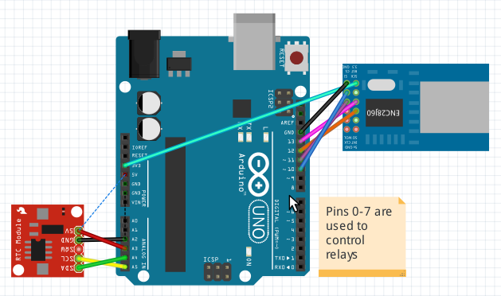

##OpenSprinklerMicro

OpenSprinklerMicro is a minimalistic version of the OpenSprinkler irrigation controller that can run on standart Arduino Uno hardware and shields. The following features were removed/disabled due to the Uno storage/memory constraints:

- Support for LCD and buttons
- Logging and support of SD card
- Support for RF and remote stations
- Flow sensor support
 
 The code now also supports relay board/relays connected directly to the pins 0-7 without shift register. The contrloller connects to the network as DHCP client using software MAC address **00:69:69:2d:31:00** and hostname **OS-AA**.
 
###Hardware:

The following hardware shields are required:

- Arduino Uno R3
- DS1307 real-time clock shield
- ENC28J60 Ethernet module
- Relay board of your choice
- (optionally) a shift register
 

I found that RTC module (DS1307) seems to have issues causing I2C bus to freeze - this problem (and solution to it) were best described by Paul O'Dowd in his blog post:

http://www.paulodowd.com/2015/04/ds1307-woes-i2c-freezes-and-locks.html

so the code now uses WsWire instead of standart Wire library. DS1307 is connected directly to A2-A5 pins. The complete list of libraries used:

- SPI
- DS1307RTC
- Time
- [WsWireLib](https://github.com/steamfire/WSWireLib)

###Software:

 The code is shrinked to 30800 bytes (94% of Uno memory). To achieve this, it was compiled with the following options:
 
####GCC:
 
- fno-inline-small-functions
- funsigned-char
- fshort-enums
 
  https://gcc.gnu.org/onlinedocs/gcc/Optimize-Options.html
 
####AVR-specific:
 
- mcall-prologues
 
  https://gcc.gnu.org/onlinedocs/gcc/AVR-Options.html
 
Please refer to the links above for the detailed description of each option.
 
I beleive that support of the flow sensor could be reenabled in the future with the further optimization of the source code.
  